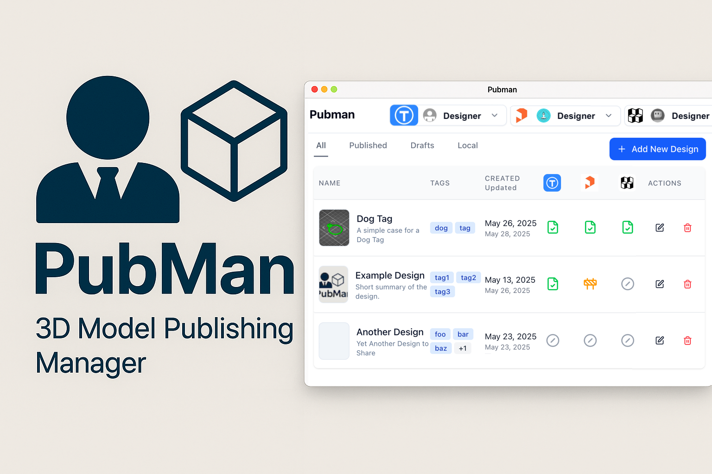

# 👤 PubMan – Your Central Hub for 3D Model Publishing

Helps 3D designers **draft, track, and publish models** to multiple platforms _from a single dashboard_.

### ✨ Features

- ✅ **Draft Once, Publish Anywhere**
  Manage files, images, and metadata for your models in one place. Publish to supported sites with one click.

- 🔄 **Sync Updates**
  Push updates across multiple platforms—without duplicate work.

- 📋 **Visual Dashboard**
  See all your designs at a glance, with per-platform publishing status.

### 🖥 Desktop App Built by a Designer for Designers

PubMan is available for:
- macOS (Apple Silicon & Intel)  
- Windows 10/11  
- Linux (AppImage)

### 🔗 Download

Download the latest release from the [Releases page](https://github.com/DrawnToDigital/pubman/releases)
- **Note:** PubMan is currently in **alpha**. Expect bugs and limited features.

### 📌 Supported Platforms

| Thingiverse   | Printables    | MakerWorld  | Thangs       | MyMiniFactory | Cults3D    |
|---------------|---------------|-------------|--------------|---------------|------------|
| ✅ Supported  | ✅ Supported | ✅ Supported | 📋 Planned  | 📋 Planned    | 📋 Planned |

### ⁉️ Questions or Concerns

Create an [issue](https://github.com/DrawnToDigital/pubman/issues)
